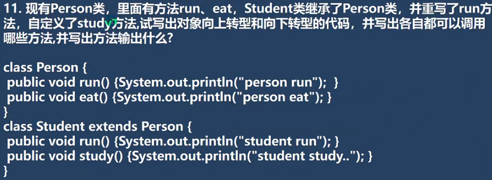

回答:
```
Person p = new Student();//向下转型
可以调用
    run() 方法, 输出sutdent run
    eat() 方法, 输出person eat


Student student = (Student) p;//向上转型
可以调用
    run() 方法, 输出student run
    eat() 方法, 输出person eat
    study() 方法, 输出student study
```