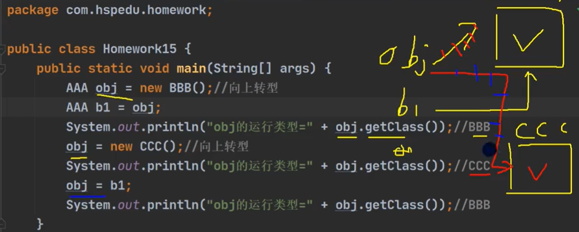

回答
```text
方法或对象具有多种形态.是面向对象(OOP)的第三大特征,多态是建立在封装和继承基础之上的

方法多态
1. 重载体现多态.
2. 重写体现多态

对象多态
1. 一个对象的编译类型和运行类型可以不一致, 编译类型在定义对象时就确定了, 不能改变
2.运行类型可以变化的, 可以通过getClas()来查看运行类型
3. 编译类型看定义时 = 号的左边,运行类型看 = 号的右边

案例：
    Animal cat = new Cat();
    Animal dog = new Dog();

```