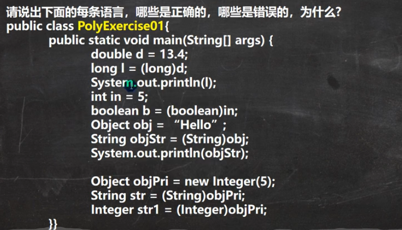

### 回答:
```aidl
double d = 13.4;
long l = (long)d; // 正确,强制转换类型
int in = 5
boolean b = (boolean)in; // 错误, boolean 无法跟int类型相互转换, 运行类型与编译类型不同
Object obj = "Hello";
String objStr = (String)obj; // 正确,强制转换类型

Object objPri = new Integer(5);
String str = (String)objPri; // 错误, objPri运行类型是integer,不能跟String转换
Integer str1 = (Integer)objPri; // 正确,编译类型与运行类型相等
```