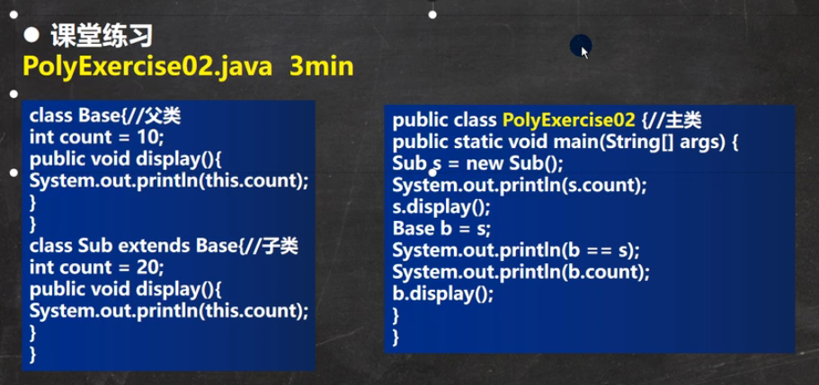

### 回答
```aidl
Base
    int count = 10; //正确
    display(): System.out.println(this.count); 

Sub extends Base
    int count = 20; //错误
    display(): System.out.println(this.count); 
    
Sub s = new Sub();
System.out.println(s.count); //输出20
s.display(); //输出20
Base b = s; //向上转型
System.out.println(b == s); //输出true
System.out.println(b.count); //输出10, 属性值直接输出父类属性
b.display(); //输出20
```